# 表示している範囲の緯度経度のみをPostGISから取得しよう

http://play.mylab.jp/webgis-hands-on/postgis/sample-2-1/index.html

index.htmlとmain.cssは変更なし

main.jsの変更点は下記2点。

1. idle(待機)イベントが発生したら、idleMapsメソッドを呼ぶ
2. api.phpに表示領域の東西南北の座標を緯度経度でパラメータとして渡す



api.phpの変更点は下記2点。

1. パラメータとして渡された東西南北の緯度経度から、四角形のポリゴンデータを生成する
2. 生成した四角形に含まれるデータのみを取得するようSQLに条件追加




main.js

```diff
'strict'

var map = null;

function initMap() {
  map = new google.maps.Map($('#map').get(0), {
    center: {lat: 35.172899, lng: 136.887531},
    zoom: 15
    });

+  google.maps.event.addListener(map, 'idle', idleMaps);
+}
+
+function idleMaps()
+{
+  var zoom = map.getZoom();
+  var bounds = map.getBounds();
+  var ne = bounds.getNorthEast();
+  var sw = bounds.getSouthWest();
+  var params = 'zoom=' + zoom + '&n=' + ne.lat() + '&s=' + sw.lat() + '&e=' + ne.lng() + '&w=' + sw.lng();
+
  $.ajax({
-    url: 'api.php',
+    url: 'api.php?' + params,
    type: 'GET',
    dataType: 'json'
  })
  .done(function(data){
    console.log(data);
    render(data);
  })
  .fail(function(){
    console.log('error');
  });
}

function render(data){
  data.forEach(function(geom){
    var circle = new google.maps.Circle({
      map: map,
      center: {lat: geom.coordinates[1], lng: geom.coordinates[0]},
      radius: 100
    });
  });
}
```

api.php

```diff
<?php

define('DSN', 'dbname=opendata user=guest');

$db = pg_connect(DSN);
if(!$db){
    echo 'error not connected';
    return;
}

+$north = $_GET['n'];
+$west = $_GET['w'];
+$east = $_GET['e'];
+$south = $_GET['s'];
+$zoom = $_GET['zoom'];
+
+$geom = 'POLYGON((';
+$geom .= $west . ' ' . $north . ',';
+$geom .= $west . ' ' . $south . ',';
+$geom .= $east . ' ' . $south . ',';
+$geom .= $east . ' ' . $north . ',';
+$geom .= $west . ' ' . $north;
+$geom .= '))';
+
$sql = <<<EOS
SELECT ST_AsGeoJson((geom)) AS geojson
FROM mcdnald2
+WHERE ST_Intersects(geom, ST_GeomFromText($1, 4326)) = True
EOS;

$result = pg_prepare($db, '', $sql);
-$result = pg_execute($db, '', []);
+$result = pg_execute($db, '', [$geom]);

$json = [];
while(($row = pg_fetch_assoc($result)) != NULL){
    $json[] = json_decode($row['geojson']);
}

echo json_encode($json);
```

上記のみでは再描画のたびに円が上書きされてしまう。そのため、再描画の際は描画済みの円を削除する必要がある。

http://play.mylab.jp/webgis-hands-on/postgis/sample-2-2/index.html

main.js

```diff
'strict'

var map = null;
+var objects = [];

function initMap() {
  map = new google.maps.Map($('#map').get(0), {
    center: {lat: 35.172899, lng: 136.887531},
    zoom: 15
    });

  google.maps.event.addListener(map, 'idle', idleMaps);
}

function idleMaps()
{
  var zoom = map.getZoom();
  var bounds = map.getBounds();
  var ne = bounds.getNorthEast();
  var sw = bounds.getSouthWest();
  var params = 'zoom=' + zoom + '&n=' + ne.lat() + '&s=' + sw.lat() + '&e=' + ne.lng() + '&w=' + sw.lng();

  $.ajax({
    url: 'api.php?' + params,
    type: 'GET',
    dataType: 'json'
  })
  .done(function(data){
    console.log(data);
    render(data);
  })
  .fail(function(){
    console.log('error');
  });
}

function render(data){
+  objects.forEach(function(o){
+    o.setMap(null);
+  });
+
  data.forEach(function(geom){
    var circle = new google.maps.Circle({
      map: map,
      center: {lat: geom.coordinates[1], lng: geom.coordinates[0]},
      radius: 100
    });
+
+    objects.push(circle);
  });
}
```
